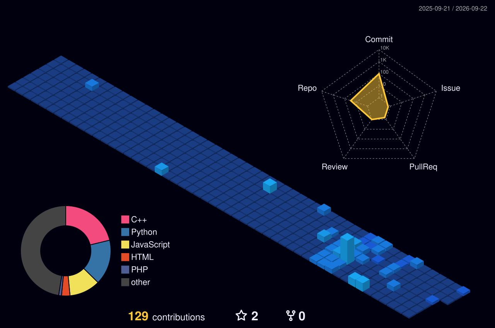

<p align="center">
  
</p> 

<p align="center">
  
</p> 

<p align="center">
  
</p>

<p align="center">
  <a href="https://linkedin.com/in/arshadd-ali/"></a>
  <a href="mailto:arshadalii8603@gmail.com"></a>
  <a href="https://github.com/Arshad-ali02"></a>
</p>

<p align="center">
  
  
</p>

## 👾 About Me

```yaml
name: Arshad Ali
role: Computer Science Student | Backend Developer in Progress
location: Lahore, Pakistan

what_i_do:
  - Build backend projects with Python, Django, and Django REST Framework
  - Practice clean API design, serializers, viewsets, and routing
  - Share my learning journey from C++/PHP to Python/Django on LinkedIn

currently:
  - Studying BS Computer Science (5th Semester)
  - Building real-world backend projects and improving problem-solving
  - Strengthening core CS concepts: DSA, OOP, and databases

passionate_about:
  - Backend development and scalable web applications
  - Writing Pythonic code (not translated C++/PHP style)
  - Community participation (SkillSprint, codrithm)

open_to:
  - Backend Development Internships (On-site)
  - Junior Python/Django roles
  - Collaboration on student and open-source projects
```

## 🛠️ Tech Stack

<p align="center">
  
</p>

## 🔭 Currently Building

- 🚀 **LinkedIn Post Scheduler API** — a Django REST Framework backend with a `Post` model (status & platform choices, `DateTimeField`), custom `@action` endpoints, ViewSets, Serializers, and Routers
- 📚 Working a self-imposed Python → Django curriculum: from raw HTTP APIs with `http.server` up to full DRF
- 🌱 Rebuilding a dev environment from scratch and retraining muscle memory to write idiomatic Python, not translated C++/PHP

## 📌 Featured Projects

<table>
  <tr>
    <td width="50%" valign="top">
      <h3>🏋️ Multi-Vendor Gym Management System</h3>
      <p><b>PHP · MySQL · Stripe · Bootstrap 5 · Chart.js</b></p>
      <p>A role-based platform where gym owners manage trainers and membership plans, members pay through Stripe Checkout, and a super admin oversees vendor approvals and a 30/70 revenue split.</p>
      <p>
        <a href="https://github.com/ARSHAD-ALI02/multi-vendor-gym-with-stripe">
          
        </a>
      </p>
    </td>
    <td width="50%" valign="top">
      <h3>📅 LinkedIn Post Scheduler API</h3>
      <p><b>Python · Django · Django REST Framework</b></p>
      <p>A DRF backend for scheduling and managing social posts — custom model choices, action endpoints, and full ViewSet/Serializer/Router wiring. Actively in progress.</p>
      <p>
        <a href="https://github.com/ARSHAD-ALI02/linkedin-post-scheduler-api">
          
        </a>
      </p>
    </td>
  </tr>
  <tr>
    <td width="50%" valign="top">
      <h3>🏦 Bank Management System</h3>
      <p><b>C++ · OOP</b></p>
      <p>A console-based banking system built to put core OOP concepts — encapsulation, class design, inheritance — into practice.</p>
      <p>
        <a href="https://github.com/ARSHAD-ALI02/Bank-Management-System">
          
        </a>
      </p>
    </td>
    <td width="50%" valign="top">
      <h3>🧾 Tip Calculator & Bill Splitter</h3>
      <p><b>HTML · Bootstrap 5 · JavaScript</b></p>
      <p>A real-time bill splitter with instant DOM updates and inline validation.</p>
      <p>
        <a href="https://github.com/ARSHAD-ALI02/Tip-Calculator-Bill-Splitter">
          
        </a>
      </p>
    </td>
  </tr>
</table>

## 📎 Pinned Repositories

## 📌 Pinned Projects

<table>
  <tr>
    <td width="50%" valign="top">
      <h3>💻 Multi-Vendor-Gym-With-Stripe</h3>
      <p>Role-based gym SaaS with vendor/member/admin flows, Stripe checkout, and revenue split logic.</p>
      <p>
        
        
        
      </p>
      <p>
        <a href="https://github.com/ARSHAD-ALI02/multi-vendor-gym-with-stripe">🔗 Repository</a><br/>
        
        
      </p>
    </td>
    <td width="50%" valign="top">
      <h3>🐍 Django-Learning</h3>
      <p>Backend learning repo focused on Django + DRF, API design, serializers, viewsets, and routing.</p>
      <p>
        
        
        
      </p>
      <p>
        <a href="https://github.com/ARSHAD-ALI02/linkedin-post-scheduler-api">🔗 Repository</a><br/>
        
        
      </p>
    </td>
  </tr>
  <tr>
    <td width="50%" valign="top">
      <h3>🏦 Bank-Management-System</h3>
      <p>Console-based C++ OOP project implementing banking operations and core object-oriented concepts.</p>
      <p>
        
        
      </p>
      <p>
        <a href="https://github.com/ARSHAD-ALI02/Bank-Management-System">🔗 Repository</a><br/>
        
        
      </p>
    </td>
    <td width="50%" valign="top">
      <h3>🧾 Tip-Calculator-Bill-Splitter</h3>
      <p>Responsive frontend utility with live calculations, clean UI interactions, and instant updates.</p>
      <p>
        
        
        
      </p>
      <p>
        <a href="https://github.com/ARSHAD-ALI02/Tip-Calculator-Bill-Splitter">🔗 Repository</a><br/>
        
        
      </p>
    </td>
  </tr>
</table>

## 🌱 Beyond the Code

- 🎓 IEEE Student Chapter member — active at society fairs and events
- 📢 Marketing & content contributor at **Skill Sprint**, a student community
- 🧭 Campus Ambassador at **LoopLab**
- 🤖 Attended **GitHub Copilot Dev Days**
- ✍️ Writes LinkedIn posts on tech, campus life, and the C++-to-Django journey

## 📊 GitHub Analytics

<p align="center">
  <a href="https://github.com/ARSHAD-ALI02">
    
  </a>
  <a href="https://github.com/ARSHAD-ALI02">
    
  </a>
</p>

<p align="center">
  
</p>

<p align="center">
  
</p>

<p align="center">
  
</p>

## 📈 Deep GitHub Insights

<p align="center">
  
  
</p>

<p align="center">
  
  
</p>

## 📈 3D Contribution Graph

<p align="center">
  
</p>

## 🐍 Contribution Snake

<p align="center">
  <picture>
    <source media="(prefers-color-scheme: dark)" srcset="https://raw.githubusercontent.com/ARSHAD-ALI02/arshad-ali02/output/github-snake-dark.svg" />
    <source media="(prefers-color-scheme: light)" srcset="https://raw.githubusercontent.com/ARSHAD-ALI02/arshad-ali02/output/github-snake.svg" />
    
  </picture>
</p>

## 📬 Let's Connect

I'm learning backend development publicly and am open to internships or junior roles where I can continue growing. If you're hiring, mentoring, or just want to talk Python/Django — reach out.

<p align="center">
  <a href="https://linkedin.com/in/arshadd-ali/"></a>
  &nbsp;
  <a href="mailto:arshadalii8603@gmail.com"></a>
</p>


